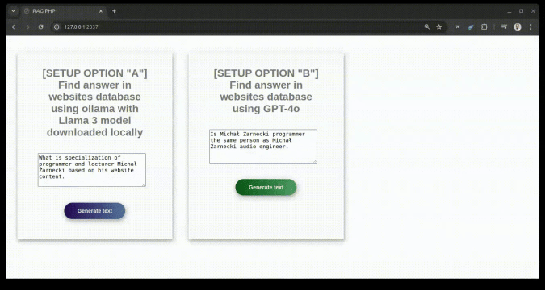
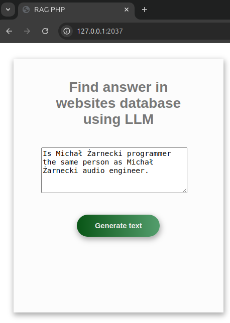
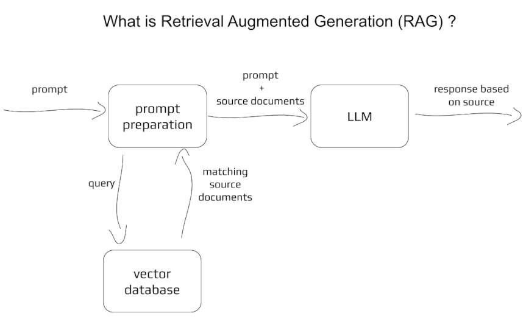

# RAG PHP Application

A Retrieval Augmented Generation application that combines the power of Large Language Models with document retrieval capabilities.



## Table of Contents

1. [Overview](#-overview)
2. [Features](#-features)
3. [Prerequisites](#-prerequisites)
4. [Installation](#️-installation)
5. [Usage](#-usage)
   - [Web Interface](#web-interface)
   - [API Endpoint](#api-endpoint)
   - [CLI Interface](#cli-interface)
6. [Example Outputs](#-example-outputs)
   - [Basic Arithmetic](#basic-arithmetic)
   - [Complex Context Analysis](#complex-context-analysis)
7. [Architecture](#-architecture)
   - [Basic Concept](#basic-concept)
   - [Detailed Architecture](#detailed-architecture)
8. [Debugging](#-debugging)
9. [Customize](#-customize)
10. [Resources](#-resources)
11. [Local Ollama Setup](#-local-ollama-setup)
12. [Contributing](#-contributing)

## 🎯 Overview

This application leverages OpenAI's GPT-4 and other LLMs to generate contextually relevant responses based on user input. It searches through a database of over 1,000 websites to provide accurate information, with special handling for disambiguating between entities with identical names. It can be used for semantic search and context aware question-answering for any text dataset. 

The application demonstrates an interesting use case of distinguishing between two different people named "Michał Żarnecki" in different contexts, showcasing the power of context-aware information retrieval.

📖 For a detailed explanation of concepts used in this application, check out my article on [Medium](https://medium.com/@michalzarnecki88/a-guide-to-using-llm-retrieval-augmented-generation-with-php-3bff25ce6616).

## 🚀 Features

- Multiple LLM support (GPT-4, Claude-3.5, Llama3.2, Mixtral, Gemini2)
- Vector database for efficient information retrieval
- Web interface, API endpoints, and CLI access
- Context-aware response generation
- Docker-based setup for easy deployment

## 📋 Prerequisites

- Docker and Docker Compose ([Installation Guide](https://docs.docker.com/compose/install/))

## 🛠️ Installation

1. **Install Dependencies**
   ```bash
   cd app/src && composer install
   ```

2. **Configure Environment**
    - Copy `.env-sample` to `.env` in `app/src`
    - Choose your model in `.env`:
      ```env
      MODEL=<model-option>  # Options: GPT-4o, Claude-3.5, Llama3.2, Mixtral, Gemini2
      ```

3. **API Configuration**

   #### Local API Options (Mixtral, Llama3.2)
    - No API key required (go directly to point 4.)
    - Requires more CPU/RAM
    - GPU recommended for better performance
    - Uses [Ollama](https://ollama.com/) for local model serving

   #### Cloud API Options (GPT-4o, Claude, Gemini)
    - Requires API key
    - Lower resource requirements
    - Add to `.env`:
      ```env
      OPENAI_API_KEY=your-api-key
      ```
      (or modify other env variable related to chosen model)
    - Get OpenAI API key from [OpenAI Platform](https://platform.openai.com/settings/profile?tab=api-keys) (or one related to other API based model)

4. **Launch Application**
   ```bash
   docker-compose up
   ```
   > Note: In case of using API access to LLM (other option than Ollama) run `docker-compose -f docker-compose-llm-api.yaml up` to avoid waisting time on downloading models to local env. 

   > Note: Initial document transformation may take long time. As default only part of documents is loaded. To process all documents, modify `$skipFirstN` in `app/src/service/DocumentLoader.php:20`.

5. **Access Application**
    - Wait for the setup completion message:
      ```
      php-app             | Loaded documents complete
      php-app             | Postgres is ready - executing command
      php-app             | [Sat Nov 02 11:32:28.365214 2024] [core:notice] [pid 1:tid 1] AH00094: Command line: 'apache2 -D FOREGROUND'
      ```
    - Open [http://127.0.0.1:2037](http://127.0.0.1:2037) in your browser

## 💻 Usage

### Web Interface
Visit [http://127.0.0.1:2037](http://127.0.0.1:2037) and enter your query.



### API Endpoint
```bash
curl -d '{"prompt":"what is result of 2+2?"}' \
     -H "Content-Type: application/json" \
     -X POST \
     http://127.0.0.1:2037/process.php?api
```

### CLI Interface
```bash
docker exec -it php-app sh
php minicli rag
```


## 📝 Example Outputs

### Basic Arithmetic
```
Input: What is the result of 2 + 2?
Response: The result of 2 + 2 is 4.
```

### Complex Context Analysis
```
Input: Is Michał Żarnecki programmer the same person as Michał Żarnecki audio engineer?
Response: These are two different individuals:

- The programmer specializes in Python, PHP, JavaScript, and AI/ML technologies
- The audio engineer (1946-2016) was a renowned sound director in Polish film
```

## 🔄 Architecture

### Basic Concept


### Detailed Architecture


## 🐛 Debugging

To rebuild after PHP script changes:
```bash
docker-compose rm
docker rmi -f php-rag
docker-compose up
```

To rebuild after pg_vector db related changes:
```bash
docker-compose rm
docker rmi -f ankane/pgvector
docker-compose up
```

## 🎚 Customize
- Use different LLMs. \
You can pick from available LLMs: `GPT-4o, Claude-3.5, Llama3.2, Mixtral, Gemini2` \
For using other ones you can just modify model name in LLM client class for model provider, for example `app/src/service/openai/GeneratedTextFromGPTProvider.php:13`
```php
    final class GeneratedTextFromGPTProvider extends AbstractGPTAPIClient
        implements StageInterface, GeneratedTextProviderInterface
    {
        private string $model = 'gpt-4o';
```
- Use different embeddings model. \
Modify `app/src/loadDocuments.php:13` and `app/src/process.php:20`. \
Put there one of classes that implement `TextEncoderInterface` or create yours that satisfies interface.\
Embedding size can have impact on text matching precision. 
- Modify system prompt. \
Modify system prompt text in `\service\PromptResolver::getSystemPrompt()`. \
You can add there additional instructions, example solutions (one-shot/few-shot) or some patterns of reasoning (chain of thought).
```php
    private function getSystemPrompt(): string
    {
        return 'You are a helpful assistant that answers questions based on source documents.' . PHP_EOL;
    }
```
- Use different number of retrieved documents. \
Change `$limit` in `DocumentProvider::getSimilarDocuments()`
```php
    public function getSimilarDocuments(
        string $prompt,
        string $embeddingPrompt,
        bool $useReranking = false,
        int $limit = 10,
        string $distanceFunction = 'l2'
    ) {
```
- Use reranking. \
If too many documents are passed to LLM it may focus on wrong information. If number is too small on the other hand it's possible to miss most important sources.\
Set `Payload::$useReranking` to `True` in `app/src/process.php:25`.
- Use different text matching algorithm. \
Change `$distanceFunction` in `DocumentProvider::getSimilarDocuments()`. \
Pick one from l2|cosine|innerProduct or support other one (see https://github.com/pgvector/pgvector, section "Quering").
```php
    public function getSimilarDocuments(
        string $prompt,
        string $embeddingPrompt,
        bool $useReranking = false,
        int $limit = 10,
        string $distanceFunction = 'l2'
    ) {
```    

## 📚 Resources

- Dataset: "Website Classification" by Hetul Mehta on [Kaggle](https://www.kaggle.com/datasets/hetulmehta/website-classification)
- Related Articles:
    - [Create a Chatbot with Langchain and RAG](https://medium.com/mlearning-ai/create-a-chatbot-in-python-with-langchain-and-rag-85bfba8c62d2)
    - [PHP-RAG Repository](https://github.com/Krisseck/php-rag)

## 🔧 Local Ollama Setup

1. Download [Ollama](https://ollama.com/download)
2. Pull required models:
   ```bash
   ollama pull llama3:latest
   ollama pull mxbai-embed-large
   ```
3. Verify installation:
   ```bash
   ollama list
   ```
4. Start server:
   ```bash
   ollama serve
   ```
5. Use `MxbaiTextEncoder.php` class in `app/src/loadDocuments.php`

## 👥 Contributing

Found a bug or have an improvement in mind? Please:
- Report issues
- Submit pull requests
- Contact: michal@zarnecki.pl

Your contributions make this project better for everyone!