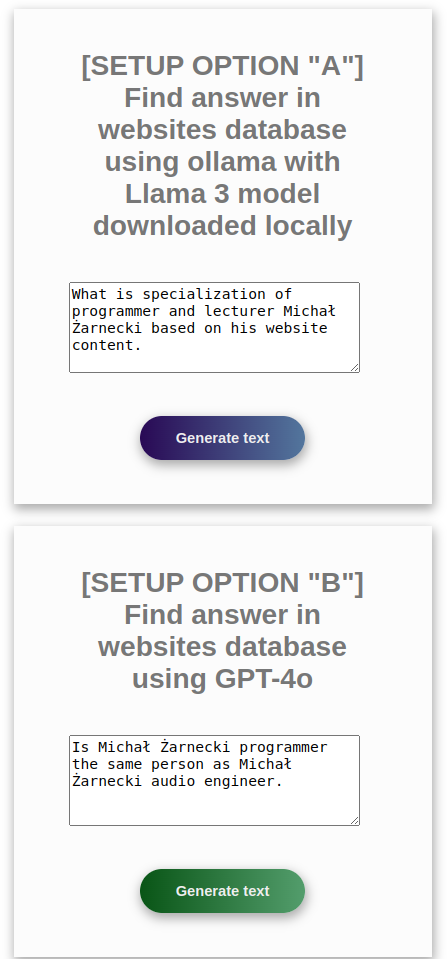

# Creating RAG (Retrieval Augmented Generation) application in PHP

This application uses LLM (Large Language Model) GPT-4o accessed via OpenAI API in order to generate text based on the user input. 
The user input is used to retrieve relevant information from the database and then the retrieved information is used to generate the text.
This approach combines power of transformers and access to source documents.

I described concepts used in this application with more details in article on medium.com
https://medium.com/@michalzarnecki88/a-guide-to-using-llm-retrieval-augmented-generation-with-php-3bff25ce6616

## Setup:
1. Run in CLI: `cd app/src && composer install`

2. Setup language model - choose option with OpenAI API "A" or option "B" with free model via local ollama API

Option B is simplier and requires less resources CPU and RAM, but you need OpenAI API key `https://platform.openai.com/settings/profile?tab=api-keys` 

Option A requires more resources CPU and RAM, but you can run it locally using ollama API. For this option it's good to have GPU.
- A. Download Llama3 model using ollama* and run LLM locally (this option is slower na need more resources but works fully on local env):
- A.1. Download ollama from `https://ollama.com/download`
- A.2. Download Llama 3 8B with `ollama pull llama3:latest`
- A.3. Download mxbai embedding model `ollama pull mxbai-embed-large`
- A.4. Make sure models are downloaded and ollama is running

```
ollama list
NAME                    	ID          	SIZE  	MODIFIED       
mxbai-embed-large:latest	468836162de7	669 MB	7 seconds ago 	
llama3:latest           	365c0bd3c000	4.7 GB	17 seconds ago	
```

- A.5. Start ollama server `ollama serve`
- A.6. use MxbaiTextEncoder.php class in `app/src/loadDocuments.php` (default)

*Ollama provides local API serving LLMs:
"Get up and running with large language models."
`https://ollama.com/`

- B. Run GPT-4o via OpenAI API (this option is faster but requires OpenAI API key):
- B.1. Create api_key.txt file inside app/src and put there your OpenAI API key
- B.2. use Ada002TextEncoder.php in class in app/src/loadDocuments.php


3. Run docker-compose: `docker-compose up`

4. Open address [127.0.0.1](http://127.0.0.1/)  in browser and ask your question



## Usage:

### Web browser
1. After docker compose finish setup containers open address [127.0.0.1](http://127.0.0.1/) in browser and ask your question

### CLI
1. Run docker interactive `docker exec -it php-app sh`

2. Run in CLI: `php minicli rag`

3. Ask question

## Example output:
#### Example 1
```
##### INPUT:
What is the result of 2 + 2?
##### RESPONSE:
The result of 2 + 2 is 4.
```

#### Example 2
```
##### INPUT: 
what is specialization of Michał Żarnecki based on his website content
##### RESPONSE:
Michał Żarnecki is a programmer and lecturer specializing in several key areas related to modern software development and data-driven technologies.
 
His expertise includes:
1. **Programming Languages**: Python, PHP, JavaScript.
2. **AI and Machine Learning**: Designing systems and solutions related to artificial intelligence and machine learning.
3. **Data Mining and Big Data**: Extracting valuable insights from large datasets. 
4. **Natural Language Processing (NLP)**: Working on systems that understand and generate human language. 
5. **Software Development Frameworks**: Utilizing various tools and frameworks such as Streamlit, TensorFlow, PyTorch, and langchain. 
6. **Database Systems**: Implementing and working with databases like PostgreSQL, Elasticsearch, Neo4j, and others.
 
His portfolio highlights projects such as an AI chatbot for analyzing company documents and a self-driving vehicle based on TensorFlow and Raspberry Pi.
Additionally, he has contributed to conferences and created e-learning courses focused on machine learning, underscoring his dual role as a developer and educator.
```

#### Example 3
```
##### INPUT: 
Is Michał Żarnecki programmer the same person as Michał Żarnecki audio engineer?

##### RESPONSE:
Based on the information provided, it appears that Michał Żarnecki the programmer and Michał Żarnecki the audio engineer are not the same person.
Here’s why:
1. **Fields of Expertise**:
 - Michał Żarnecki, the audio engineer, was a well-known operator and reżyser dźwięku (sound director) in Poland, with notable contributions to the Polish film industry, as mentioned in the Wikipedia excerpt.
 - Michal Żarnecki, the programmer, has a portfolio focused on programming in Python, PHP, and JavaScript, with projects related to AI, machine learning, data mining, and software development.
2. **Lifespan**:
 - Michał Żarnecki the audio engineer was born on November 12, 1946, and passed away on November 21, 2016.
 - The projects listed in Michał Żarnecki the programmer’s portfolio date from 2014 to 2016, which would be conflicting if he had passed away in 2016 and was actively working in those years. 
3. **Occupational Focus**:
 - The audio engineer has a career documented in film sound engineering and education.
 - The programmer’s career is centered around software development, mobile applications, ERP systems, and consulting in technology.

Given the distinct differences in their professional domains, timelines, and expertise, it is highly unlikely that they are the same individual
```

## Concept:


## Resources:
websites used to fill vector database come from "Website Classification" dataset on Kaggle
author: Hetul Mehta
link: https://www.kaggle.com/datasets/hetulmehta/website-classification?resource=download

related articles/repositories:

https://medium.com/mlearning-ai/create-a-chatbot-in-python-with-langchain-and-rag-85bfba8c62d2

https://github.com/Krisseck/php-rag
